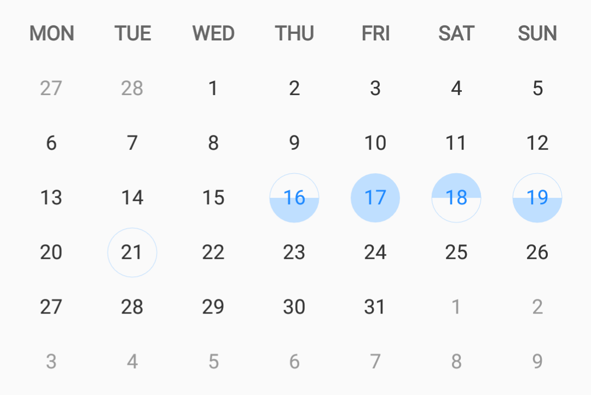

[](https://jitpack.io/#nichbar/MonthView)

# MonthView
MonthView is a lightweight month view draw by canvas.



You may customize your highlighted day with your own style.

MonthView does only provide a single month view, but you can wrap it with your own container to achieve your need.
## Download
Add this in your root build.gradle at the end of repositories:

```groovy
allprojects {
	repositories {
		...
		maven { url 'https://jitpack.io' }
	}
}
```
Then add the dependency:

```groovy
dependencies {
	compile 'com.github.nichbar:MonthView:v0.1'
}
```
## Usage

### In Layout file
You may simply code like this:

```xml
<work.nich.view.MonthView
    android:layout_width="match_parent"
    android:layout_height="wrap_content"/>
```
Then a default MonthView based on device's current month will show as a preview. 

### In JAVA

Or you may generate a MonthView instance like a normal View:

```java
MonthView monthView = New MonthView(this);
```
MonthView use [Calendar](https://developer.android.com/reference/java/util/Calendar.html) object to hold the month's basic detail like year and month.
If you wanna change MonthView to display other month, you can pass your specific Calendar to MonthView via ``setCalendar()``.

```java
monthView.setCalendar(Calendar.getInstance());
```

There are two modes in MonthView. One is ``DISPLAY_ONLY``, the other is ``SELECT``.

You need to manually set the mode you want by:

```java
monthView.setMode(MonthView.Mode.DISPLAY_ONLY);
// or monthView.setMode(MonthView.Mode.SELECT);
```

In ``DISPLAY_ONLY`` mode, you can only set a ``OnDayClickedListener`` and do whatever you what in ``onDayClicked()`` callback.

```java
monthView.setOnDayClickListener(new MonthView.OnDayClickedListener() {
      @Override
      public void onDayClicked(int day) {
            // Do whatever you want.
      }
});

```

In ``SELECT`` mode, MonthView will take control of touch event. If a unselected day in this month were touched then it will be highlighted in ```SOLID_CIRCLE``` style as default and mark as selected. In contrast, when a selected day were touched, selected tag will removed and display as another ordinary day.

You can set a ``OnDaySelectedListener`` to listen to select and deselect action callback.

```java
mMonthView.setOnDaySelectListener(new MonthView.OnDaySelectedListener() {
      @Override
      public void onDayJustSelected(int day) {
      }

      @Override
      public void onDayJustDeselected(int day) {
      }
});
```

For more detail usage, you may take a look at [WIKI]().

## License

[GPL-3.0](https://github.com/nichbar/MonthView/blob/master/LICENSE)
